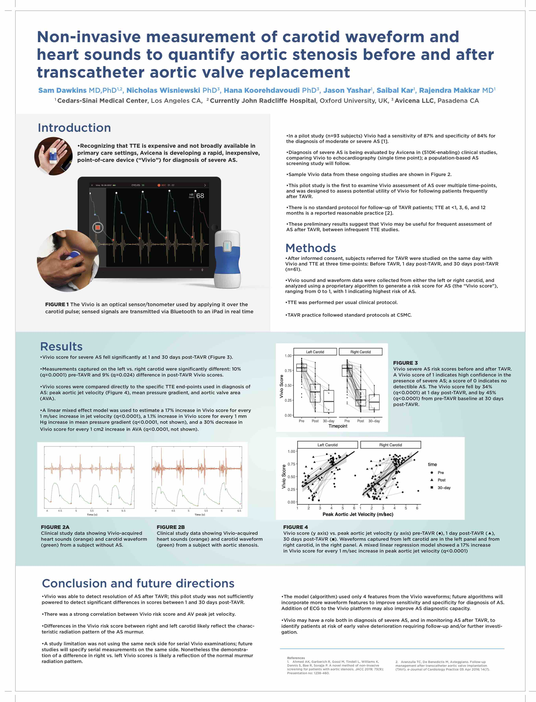

Avicena has a poster at the 2019 sessions of the Transcatheter Cardiovascular Therapeutics (TCT) conference in San Francisco! Our work assesses the potential utility of the Vivio device for following aortic stenosis patients after TAVR. 

<figure>
	
</figure>

